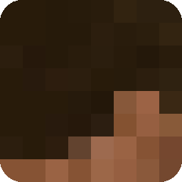

#  Explorio

Explorio is a 2D block game

## Running a server

1. Get in the directory where you want to run the server.
2. Run `npm init -y && npm install -g explorio`
3. Run `explorio` or `npx explorio`
4. Voilà! The server is up and running

## How to play?

1. Open up the client ([Click to learn more](#whats-a-client-and-where-to-find-it))
2. Press Singleplayer
3. Press New World
4. Name your world
5. Optionally select a seed
6. Press Create World
7. Click your world in the world list
8. Voilà! You're in the game

## How to connect to a server?

1. Open up the client ([Click to learn more](#whats-a-client-and-where-to-find-it))
2. Press Multiplayer
3. Press New Server
4. Name the server
5. Enter server IP and port
6. Press Add Server
7. Click the server in the server list
8. Voilà! You're in the game

## What's a client and where to find it?

The client is hosted statically by GitHub Pages on https://mc.oguzhanumutlu.com

You can also find hosted clients outside GitHub Pages and use them. **Though keep in mind that using third party clients
is risky.**

### Running/modding the client locally

1. Clone this repo ([Click to view repository](https://github.com/OguzhanUmutlu/explorio))
2. Run `npm install` and `npm run dev`
3. Open http://127.0.0.1:1923
4. Now you can make modifications to the client and reload the page
5. Optionally disable Firewall for 1923 for anyone to use your client via your local network (and IP)